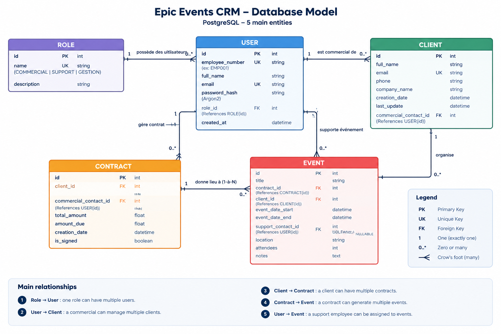

# 🏢 Epic Events CRM - Command-Line Application (CLI)

[](https://www.python.org/)
[](https://www.postgresql.org/)
[](https://www.sqlalchemy.org/)
[](https://passlib.readthedocs.io/)
[](https://sentry.io/)

**Epic Events CRM** is a secure, production-ready command-line interface (CLI) application developed in Python for managing customer relations, commercial contracts, and event planning operations.

The application strictly enforces **Role-Based Access Control (RBAC)** across three company departments: **Management (Gestion)**, **Commercial (Sales)**, and **Support**, ensuring adherence to the principle of least privilege.

---

## 📐 Architecture & Database Model (ERD)

The application relies on a normalized PostgreSQL relational database schema with 5 main entities:



### Core Entities & Relationships

1. **ROLE** (`COMMERCIAL`, `SUPPORT`, `GESTION`): Defines user department privileges.
2. **USER**: Employee account with Argon2 password hash and assigned role.
3. **CLIENT**: Customer profiles managed by an assigned Commercial representative.
4. **CONTRACT**: Commercial contracts associated with a Client and Commercial representative.
5. **EVENT**: Event logistics linked to a **signed** Contract, Client, and an assigned Support representative.

---

## 🛠️ Technical Stack

- **Core Language**: Python 3.10+
- **Database Engine**: PostgreSQL 16
- **ORM & Database Toolkit**: SQLAlchemy 2.0+
- **CLI Interface Framework**: Click 8.x + Rich (Colored tables and formatted panels)
- **Authentication & Security**: PyJWT (Persistent local session tokens) + Argon2id (`passlib[argon2]`)
- **Remote Monitoring & Audit Logging**: Sentry.io SDK
- **Testing & Quality Control**: Pytest + Pytest-Cov

---

## ⚙️ Installation & Setup Guide

### 1. Prerequisites

- Python 3.10 or higher
- PostgreSQL database engine installed and running
- Git version control

### 2. Clone the Repository

```bash
git clone https://github.com/samarkand-fr/CRM-epic-events.git
cd epic_events
```

### 3. Create and Activate Virtual Environment

```bash
python3 -m venv .venv
source .venv/bin/activate
```

### 4. Install Dependencies

```bash
pip install -r requirements.txt
```

### 5. PostgreSQL Database Setup

Log in to your local PostgreSQL instance and create the database user and database:

```sql
CREATE ROLE epic_crm_user WITH LOGIN PASSWORD '<YOUR_SECURE_PASSWORD>' NOSUPERUSER NOCREATEDB NOCREATEROLE;
CREATE DATABASE epic_crm_db OWNER epic_crm_user;
GRANT CONNECT ON DATABASE epic_crm_db TO epic_crm_user;
GRANT ALL ON SCHEMA public TO epic_crm_user;
```

### 6. Environment Configuration

Copy the template `.env.example` file to `.env`:

```bash
cp .env.example .env
```

Edit `.env` with your actual configuration credentials:

```env
DATABASE_URL=postgresql+psycopg2://epic_crm_user:<your_password>@localhost:5432/epic_crm_db
SECRET_KEY=your_long_and_secure_random_jwt_secret_key
SENTRY_DSN=https://your_sentry_dsn_here@ingest.sentry.io/project
```

### 7. Initialize Database & Inject Seed Data

Execute the seed initialization script to generate initial tables and populate test users:

```bash
python seed_db.py
```

*(Alternatively, execute the pure SQL schema file: `psql -U epic_crm_user -d epic_crm_db -f schema.sql`)*.

---

## 🔑 Default Seed Employee Accounts

| Employee N° | Full Name | Pro Email | Department / Role | Default Password |
| :--- | :--- | :--- | :--- | :--- |
| `EMP001` | Bill Boquet | `bill.boquet@epicevents.io` | `COMMERCIAL` | `Password123!` |
| `EMP002` | Kate Hastroff | `kate.hastroff@epicevents.io` | `SUPPORT` | `Password123!` |
| `EMP003` | Admin Gestion | `gestion@epicevents.io` | `GESTION` | `Password123!` |

---

## 🔒 Role-Based Access Control (RBAC) Permission Matrix

| Action / Feature | Commercial | Support | Management (Gestion) |
| :--- | :---: | :---: | :---: |
| **Authentication & Profile** (`login`, `whoami`, `logout`) | ✅ | ✅ | ✅ |
| **View Users, Clients, Contracts, Events** | ✅ | ✅ | ✅ |
| **Create & Update Employee Accounts** | ❌ | ❌ | ✅ |
| **Create Clients** | ✅ (Auto-assigned) | ❌ | ❌ |
| **Update Clients** | ✅ (Assigned only) | ❌ | ❌ |
| **Create Contracts** | ❌ | ❌ | ✅ |
| **Update Contracts** | ✅ (Assigned only) | ❌ | ✅ (Re-assign Commercial) |
| **Create Events** | ✅ (On Signed Contract) | ❌ | ❌ |
| **Update Events** | ❌ | ✅ (Assigned only) | ✅ (Assign Support) |

---

## 💻 CLI Command Usage Guide (`epicevents.py`)

### 1. Authentication Commands

```bash
# Login (via email or employee number)
python epicevents.py login

# View active session & JWT profile
python epicevents.py whoami

# Logout (invalidates local session token)
python epicevents.py logout
```

### 2. Read Commands (All Authenticated Users)

```bash
# List all collaborators
python epicevents.py display-users

# List all clients
python epicevents.py display-clients

# List contracts (with optional filters)
python epicevents.py display-contracts
python epicevents.py display-contracts --unsigned
python epicevents.py display-contracts --unpaid

# List events (with optional filters)
python epicevents.py display-events
python epicevents.py display-events --no-support
python epicevents.py display-events --my-events
```

### 3. Management Department Operations (`GESTION`)

```bash
# Create a new employee
python epicevents.py create-user

# Update employee details or role
python epicevents.py update-user --user-id 4 --role GESTION

# Create a contract for a client
python epicevents.py create-contract

# Update contract status or amounts
python epicevents.py update-contract --contract-id 3 --signed

# Assign a Support employee to an unassigned Event
python epicevents.py update-event --event-id 4 --support-id 2
```

### 4. Commercial Department Operations (`COMMERCIAL`)

```bash
# Create a new client (auto-assigned to active Commercial user)
python epicevents.py create-client

# Update assigned client contact information
python epicevents.py update-client --client-id 1 --phone "+33145889900"

# Create an Event (CRITICAL: Contract MUST be signed!)
python epicevents.py create-event
```

### 5. Support Department Operations (`SUPPORT`)

```bash
# Display assigned events
python epicevents.py display-events --my-events

# Update assigned event details (venue, dates, notes, attendees)
python epicevents.py update-event --event-id 1 --location "Le Palais des Congrès" --notes "Installation sono à 8h."
```

---

## 🛡️ Security Features & Best Practices

1. **SQL Injection Prevention**: Exclusive usage of SQLAlchemy 2.0 ORM parameterized queries with prepared statements.
2. **Password Security**: Argon2id password hashing with dynamic salting. No plaintext passwords in memory or database.
3. **Session Security**: JWT tokens stored locally at `~/.epic_events_token` with POSIX file permissions `0600` (Owner read/write only).
4. **RBAC Enforcement**: `@require_role(...)` decorators on Click CLI entrypoints + domain controller validation checks.
5. **Secret Management**: `.env` excluded from version control via `.gitignore`.
6. **Remote Audit Logging**: Sentry.io SDK captures unhandled exceptions, failed login attempts, RBAC violations, user management actions, and contract signatures.

---

## 🧪 Testing & Code Coverage

Run unit tests and generate code coverage reports with Pytest:

```bash
# Run test suite
pytest

# Generate coverage report
pytest --cov=.
```

---

## 📄 License

Developed for **Epic Events CRM**. All rights reserved.
